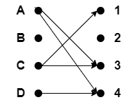
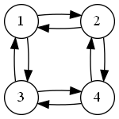
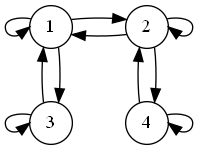

# CSE 280 Prove 05

(c) BYU-Idaho - It is an honor code violation to post this
file completed or uncompleted in a public file sharing site.

**Instructions**: Answer each question using proper markdown notation as needed.  Use the preview view in Visual Studio Code (or another editor if desired) to see the formatting, tables, and mathematical formula properly rendered.  If you need to write code, then first test your code in a separate file and then copy the code into this document using code fences. 

**Name**: Mahonri "Mo" Ray

**Section**: MWF 10:15-11:15

**Teacher**:Chad MacBeth

## Question 1 (5 points)

What is the set that corresponds to the relation given in the arrow diagram below:

**Answer**: $\lbrace (A,3),(A,4),(C,1),(C,3),(D,4) \rbrace$

## Question 2 (6 points)

Determine if the following relations are Reflexive, Anti-Reflexive, or Neither by marking an "X" in the appropriate column of the table.  The domain of each relation $R$ is $\mathbf{R}$.

|Relation Set|Reflexive|Anti-Reflexive|Neither|
|:-:|:-:|:-:|:-:|
|$xRy, \text{ if }x \ge y$|X|||
|$xRy, \text{ if }x \gt y$||X||
|$xRy, \text{ if }x + 1 = y$||X||
|$xRy, \text{ if }x + y = 2$|||X|
|$xRy, \text{ if }\lceil x \rceil \le \lceil y \rceil$|X|||
|$xRy, \text{ if }x^3 = y^3$|X|||

## Question 3 (6 points)

Determine if the following relations (same from Question 2) are Symmetric, Anti-Symmetric, or Neither by marking an "X" in the appropriate column of the table.  The domain of each relation $R$ is $\mathbf{R}$. 

|Relation Set|Symmetric|Anti-Symmetric|Neither|
|:-:|:-:|:-:|:-:|
|$xRy, \text{ if }x \ge y$|||X|
|$xRy, \text{ if }x \gt y$||X||
|$xRy, \text{ if }x + 1 = y$||X||
|$xRy, \text{ if }x + y = 2$|X|||
|$xRy, \text{ if }\lceil x \rceil \le \lceil y \rceil$|||X|
|$xRy, \text{ if }x^3 = y^3$|X|||

## Question 4 (6 points)

Determine if the following relations (same from Question 2) are Transitive by marking "Yes" or "No" in the column of the table.  The domain of each relation $R$ is $\mathbf{R}$.

|Relation Set|Transitive|
|:-:|:-:|
|$xRy, \text{ if }x \ge y$|Yes|
|$xRy, \text{ if }x \gt y$|Yes|
|$xRy, \text{ if }x + 1 = y$|No|
|$xRy, \text{ if }x + y = 2$|No|
|$xRy, \text{ if }\lceil x \rceil \le \lceil y \rceil$|Yes|
|$xRy, \text{ if }x^3 = y^3$|No|

## Question 5 (6 points)

Determine if the following relations (same from Question 2) are Equivalences by marking "Yes" or "No" in the column of the table.  The domain of each relation $R$ is $\mathbf{R}$.

|Relation Set|Equivalence|
|:-:|:-:|
|$xRy, \text{ if }x \ge y$|No|
|$xRy, \text{ if }x \gt y$|No|
|$xRy, \text{ if }x + 1 = y$|No|
|$xRy, \text{ if }x + y = 2$|No|
|$xRy, \text{ if }\lceil x \rceil \le \lceil y \rceil$|No|
|$xRy, \text{ if }x^3 = y^3$|No|

## Question 6 (5 points)

Select the relations below that are equivalence relations if the domain is {1, 2, 3, 4} by marking "Yes" or "No" in the column of the table.

|Relation Set|Equivalence Relation|
|:-:|:-:|
|$\lbrace (1,4), (4,1), (2,2), (3,3) \rbrace$|No|
|$\lbrace (1,4), (4,1), (1,3), (3,1), (2,2) \rbrace$|No|
|$\lbrace (1,4), (4,1), (1,1), (2,2), (3,3), (4,4) \rbrace$|No|
|$\lbrace (1,4), (4,1), (1,3), (3,1), (1,1), (2,2), (3,3), (4,4) \rbrace$|Yes|
|$\lbrace (1,4), (4,1), (1,3), (3,1), (3,4), (4,3), (1,1), (2,2), (3,3), (4,4) \rbrace$|Yes|

## Question 7 (16 points)

For each directed graph below representing a relation, determine based on its form if its Reflexive, Symmetric, Transitive, and/or an Equivalence relation by marking "Yes" or "No" in the appropriate column of the table.

|Directed Graph of Relation|Reflexive|Symmetric|Transitive|Equivalence|
|:-:|:-:|:-:|:-:|:-:|
|||X|||
||X|X|X|X|
||X|X|X|X|
||X|X|X|X|
